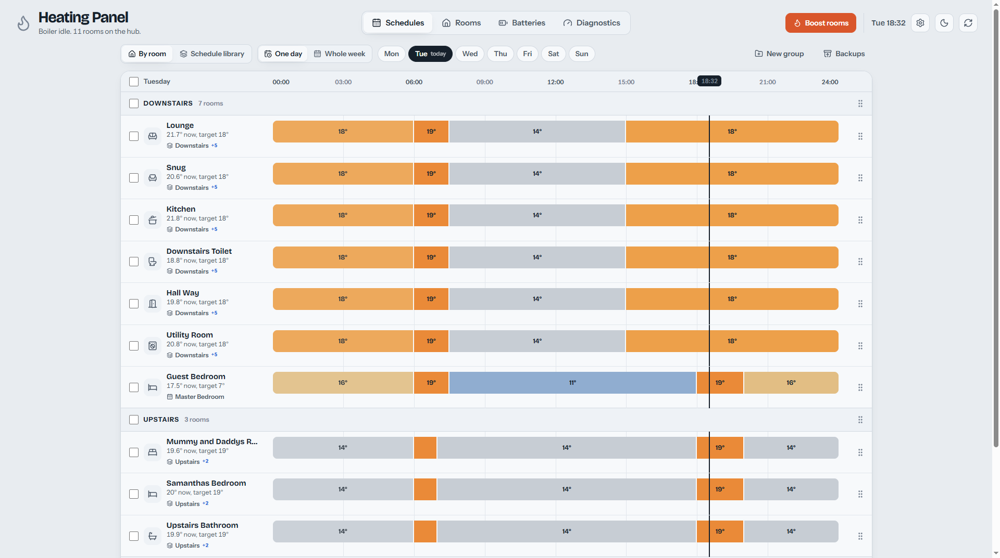
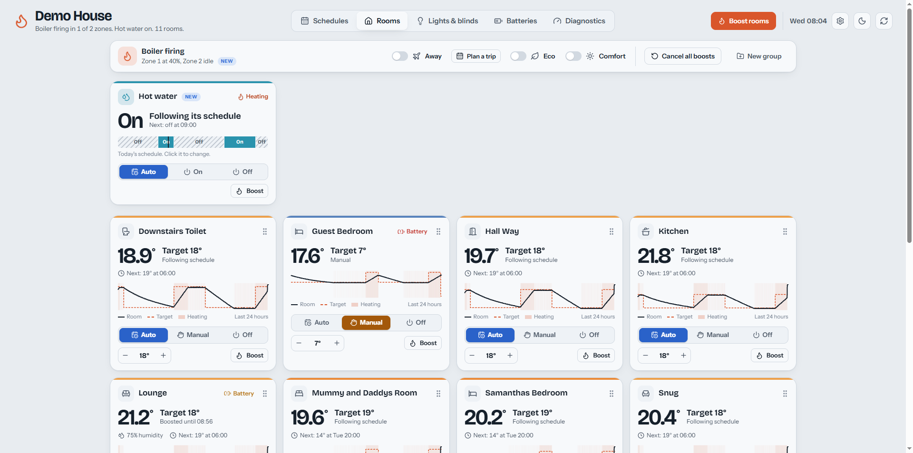
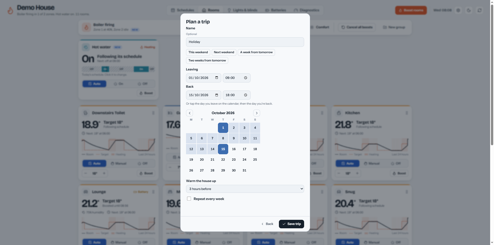
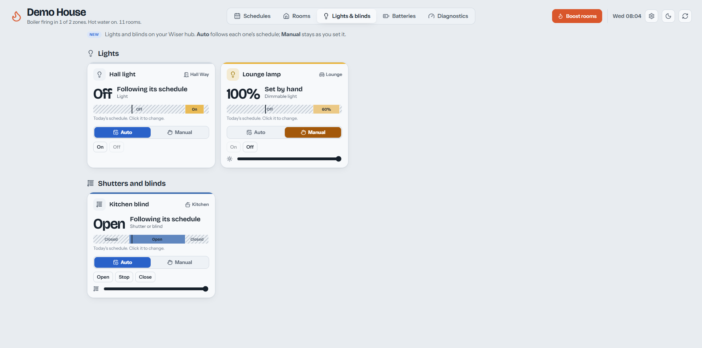
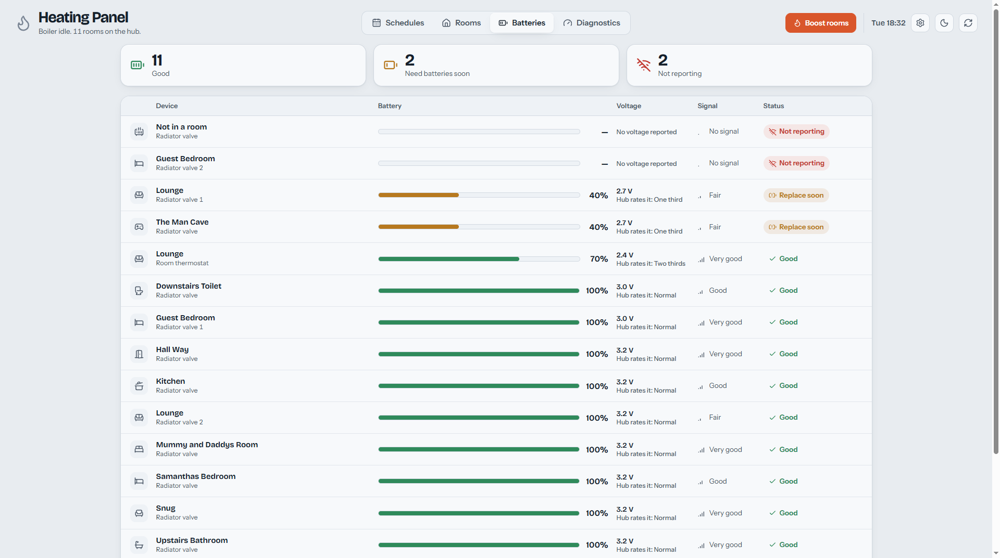
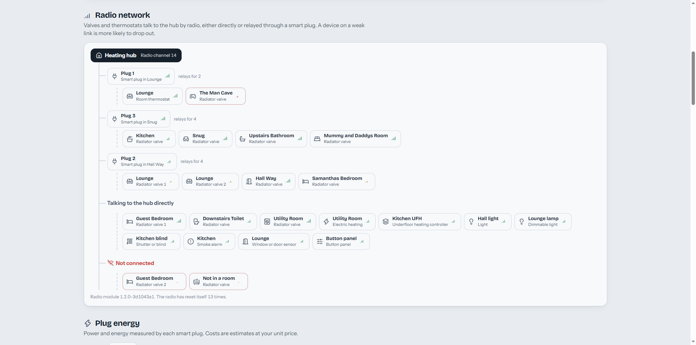

# WiserHeat Control Panel

[](#install-on-home-assistant)
[](#run-with-docker)
[](#get-started)
[](LICENSE)

**Your whole home's heating, on one screen.**

A free control panel for Drayton Wiser heating systems. It talks straight to your Wiser hub over your home network. There's no cloud service, no account and no subscription.

**Run it your way:**

- **On Windows**, or any Mac or Linux computer. Double-click `start.bat`, and open it in your browser. [Get started](#get-started).
- **As a Home Assistant app.** Install it in a few clicks and open it from the Home Assistant sidebar, signed in with your Home Assistant account. [Install on Home Assistant](#install-on-home-assistant).
- **With Docker**, on a home server, NAS or Raspberry Pi, always on for the whole house. [Run with Docker](#run-with-docker).
- **As a Linux service**, on a Raspberry Pi or Linux server without Docker. One command installs it, and it starts by itself at boot. [Install on Linux](#install-on-linux).
- **On your phone's home screen**, like an app, from anywhere on your home network, protected by a password. [Add it to your phone](#add-it-to-your-phones-home-screen).

The first time, a short setup screen finds your hub on the network and walks you through connecting to it.

**What you get:**

- Every room's schedule on one colour-coded timeline, today or the whole week
- Change a whole floor at once: warmer, cooler, earlier or later
- Sort rooms into groups like Upstairs and Downstairs with drag and drop
- Battery warnings before a radiator valve goes flat
- Temperature graphs and boiler statistics that the hub doesn't keep itself
- Years of history: any day, week, month or year, side by side with last year *(new)*
- An automatic backup before every schedule change
- Plan trips away, and the heating switches to Away and back by itself
- Hot water, heating zones, electric and underfloor heating, lights and blinds, if your system has them *(new)*

<table>
  <tr>
    <td width="33%" align="center" valign="top">
      <a href="docs/Schedules.png"></a>
      <br><sub><b>Schedules.</b> Every room's day on one timeline, in your own groups.</sub>
    </td>
    <td width="33%" align="center" valign="top">
      <a href="docs/HotWater.png"></a>
      <br><sub><b>Hot water, zones and rooms.</b> Live temperatures, modes, boosts and graphs, with hot water and heating zones.</sub>
    </td>
    <td width="33%" align="center" valign="top">
      <a href="docs/PlanaTrip.png"></a>
      <br><sub><b>Plan a trip.</b> Away mode on as you leave, and a warm house when you're back.</sub>
    </td>
  </tr>
  <tr>
    <td width="33%" align="center" valign="top">
      <a href="docs/LightsandBlinds.png"></a>
      <br><sub><b>Lights and blinds.</b> Switch, dim, open and close, with schedules.</sub>
    </td>
    <td width="33%" align="center" valign="top">
      <a href="docs/Batteries.png"></a>
      <br><sub><b>Batteries.</b> Every valve and thermostat, worst first.</sub>
    </td>
    <td width="33%" align="center" valign="top">
      <a href="docs/RadioNetwork.png"></a>
      <br><sub><b>Radio network.</b> Which plug relays for which device, and weak links.</sub>
    </td>
  </tr>
</table>

<p align="center"><sub>Click a screenshot to see it full size.</sub></p>

## Why use it?

The Wiser app is handy for a quick change from the sofa. When you want to see how the whole house is set up, or change several rooms together, a big screen makes it much easier. This panel shows every room side by side, so you can spot the room that's heating at 3 am, or line up bedtimes across the house in a few clicks.

## Highlights

### See your whole week at a glance

Every room's schedule sits on one timeline, coloured from cold blue to warm red, with a line marking the current time. Switch between a single day and the whole week. Hover over any block to see exactly when it starts and what temperature it holds.

### Edit schedules the easy way

Click any room's bar to open the editor. Drag the markers to move a change, type exact times, or step temperatures up and down. You can copy another room's day into this one. When you're done, choose which days and rooms the change applies to: *weekdays*, *weekends*, *every day*, or any mix.

Your edits are held as a draft until you press **Save to hub**. You can check everything before the heating changes.

### Change lots of rooms at once

Tick several rooms, or a whole group, and change them together:

- **Edit together** in one editor
- **Copy a week** from another room
- **0.5° warmer or cooler** across the board
- **15 minutes earlier or later** for every change

### Organise it your way

Drag rooms into the order you like, and group them under headings such as *Upstairs*, *Downstairs* or *Garage*. Groups can be dragged too, and a tick box on each one selects all its rooms. The Schedules and Rooms tabs share the same layout, so you set it up once.

### Shared schedules

Several rooms can follow one named schedule, such as *Bedrooms*. Edit it once and every room on it changes. The schedule library lets you create, duplicate, rename and delete schedules, and choose which rooms use each one.

### Never lose a schedule

Every change is backed up first, including which room follows which schedule. You can put everything back from **Backups** in a couple of clicks, and it even recreates schedules that were deleted since.

### Live control of every room

Each room card shows its current temperature and target, the humidity (in rooms with a thermostat) and how open the valve is. It also shows when the next scheduled change is.

- Switch a room between **Auto**, **Manual** and **Off**, or nudge its temperature
- **Boost** one room or the whole house by 1 to 3° for up to 3 hours
- **Away**, **Eco** and **Comfort** mode switches
- Smart plug on/off and auto/manual control

### Plan your time away

The hub's Away mode is just on or off. With **Trips**, next to the Away switch on the Rooms tab, you plan when you'll be away, and the panel switches Away mode on and off for you:

- **Plan ahead.** Add as many trips as you like, each with the time you leave and the time you're back. Presets such as *This weekend* and *A week from tomorrow* fill in the times, or you can tap the days on a calendar.
- **Come home to a warm house.** Away switches off a few hours before you're due back (three by default, or whatever suits you), so rooms are back on their schedules when you walk in.
- **Weekly repeats.** For regular absences, such as every weekend at the caravan, set a trip to repeat each week, until a date or until you delete it.
- **Plans change.** Tap **I'm home early** on the banner, or just switch Away off, and the trip ends.
- **See it coming.** While you're away, a banner says until when. The time away is also shaded on the Schedules timeline, so you can see when the normal schedule won't run.

During a trip, every room is held at the Away temperature from Settings. Boosts are cancelled when a trip starts. Smart plugs, and hot water on systems that have it, follow the hub's own Away behaviour.

Trips run on the panel's server, so they happen on time even with the page closed. That works best where the panel is always running: Home Assistant, Docker, or the Linux service. On a desktop, the computer needs to be on. If it wasn't, the panel catches up as soon as it starts again.

### Hot water, lights, blinds and more *(new)*

The panel also supports Wiser equipment beyond radiator valves and thermostats. Each part only appears if your hub has that equipment, so a simple setup stays uncluttered.

- **Hot water.** A card on the Rooms tab with **Auto**, **On** and **Off**, and a boost for 30 minutes to 3 hours. The hot water schedule sits on the Schedules timeline alongside the rooms, and you can edit it there.
- **Heating zones.** On systems with more than one heating zone, the header and the Rooms tab show which zones are firing. Diagnostics shows how long each zone has fired today, and which rooms it serves.
- **Electric and underfloor heating.** Electric heaters show their power use on the room's card. Diagnostics shows their energy use, and the underfloor controllers' relays, floor limits and condensation warnings.
- **Lights and blinds.** A **Lights & blinds** tab appears, with on/off, brightness, open/close/stop and a position slider. Each one's schedule can be edited, including sunrise and sunset times.
- **Every battery device.** Smoke alarms, window and door sensors, and button panels join the valves and thermostats on the Batteries tab.

These are marked **New** in the panel. The maintainer's own system doesn't have this equipment, so it was built from the hub's published interface and tested against a simulated hub. If you have it, please [say how it goes](https://github.com/BayMax1990/WiserHeat-ControlPanel/issues), whether it works well or something looks wrong.

### Know before the batteries die

The Batteries tab lists every radiator valve, room thermostat and other battery device, worst first. It shows an estimated charge, the voltage, the hub's own rating and the signal strength. Devices that need new batteries soon, or have stopped reporting, are flagged, and a warning also appears on the room's card.

### History the hub doesn't keep

The Wiser hub only knows what's happening right now. While the panel is running, it records temperatures in the background, so you get:

- a 24-hour temperature graph on every room card
- how long the boiler has fired, today and on each day
- which rooms call for heat the most
- how quickly each room warms up

### Years of history *(new)*

The **History** tab shows any day, week, month or year the panel has recorded:

- each room's temperature against its target, with the heating shaded
- every room's average, lowest and highest temperature, and how hard it asked for heat
- how long the boiler, each heating zone and the hot water were on
- electricity used by smart plugs and electric heaters, and what it cost

Step back through the weeks or years with the arrows. Turn on **Compare with last year** to see the same period a year earlier beside it, in grey. Amounts are compared per hour recorded, so a week that's only half over, or a day the panel was off, still compares fairly.

Recordings are kept in full detail for a year, then thinned to one reading every half hour and kept for five years. You can change both in **Settings → Recording**. Each day has its own file, and readings are only ever added to the end of it. The panel never rewrites a growing file, which is kind to a Raspberry Pi's SD card. Five years for an eleven-room house takes about 90 MB.

### Look under the bonnet

The Diagnostics tab is for when something isn't right:

- **Hub health**: Wi-Fi signal, uptime and dropped connections
- **Radio network**: which smart plug relays signals for which valve
- **Plug energy**: live power use and a running cost estimate
- **Boiler, zones and hot water**: how long each has been on, today and this week
- **Electric and underfloor heating**: power, energy and relay demand, on systems that have them
- **Tidy-up**: unused schedules, devices not assigned to a room, and devices that have gone quiet
- **Valves**: each valve's own reading, opening and firmware, plus a button lock

### Make it yours

The cog in the top corner opens **Settings**. There you can:

- set the title shown at the top of the page, for example *The Smiths' Heating*
- choose light or dark mode, or follow your computer
- choose a theme: **Modern**, or **Steampunk**, with brass and mahogany, a pressure gauge showing the boiler's demand, and gears that turn faster while it fires *(new)*
- choose the page the panel opens on, or let it open wherever you left off
- pick an icon for each room
- set your electricity price
- decide how often temperatures are recorded, how long every reading is kept, and how many years of history to keep
- change hub settings such as the away-mode temperature, valve protection and open-window detection

## Get started

1. Install [Node.js](https://nodejs.org) version 18 or newer.
2. Download this project: **Code → Download ZIP** on GitHub, then unzip it. Or clone it with git.
3. Start it. On Windows, double-click `start.bat`. On a Mac or Linux, run `node server.js` in the project folder.
4. Open **http://localhost:8765** in your browser.

The first time it runs, a setup screen asks for two things:

- **Your hub's address.** Press **Find my hub**, and the panel looks for it on your network and fills it in. Otherwise, type its IP address, for example `192.168.1.50`. Your router's list of connected devices shows it, usually with a name starting with *WiserHeat*.
- **Your hub's secret.** This is a long code that lets the panel control the hub. Press the setup button on the hub once so its light flashes, and join the *WiserHeat* Wi-Fi network it creates. Then open `http://192.168.8.1/secret` in your browser and copy the text. Press the setup button again to finish.

Press **Connect**. The panel lists the rooms it found, then opens your schedules. You can change these details later in **Settings**.

## Install on Home Assistant

The panel is also a Home Assistant app (Home Assistant used to call these "add-ons"). It needs Home Assistant OS, which most people use.

[](https://my.home-assistant.io/redirect/supervisor_add_addon_repository/?repository_url=https%3A%2F%2Fgithub.com%2FBayMax1990%2FWiserHeat-ControlPanel)

Click the button above, or add the repository by hand:

1. In Home Assistant, go to **Settings → Apps**, and click **App store** in the bottom-right corner.
2. Open the **⋮** menu in the top right, choose **Repositories**, and add `https://github.com/BayMax1990/WiserHeat-ControlPanel`.
3. Find **WiserHeat Control Panel** in the store, then click **Install**.
4. Click **Start**, and turn on **Show in sidebar**.
5. Open **WiserHeat** from the sidebar and follow the setup screen.

Home Assistant handles signing in, so the panel doesn't ask for a password. The panel's settings, history and schedule backups are included in your Home Assistant backups. After five years, the history adds about 90 MB to each backup, for an eleven-room house.

## Run with Docker

For a home server, NAS or Raspberry Pi. Images are built for PCs (amd64) and 64-bit ARM boards (arm64).

```
docker run -d --name wiserheat-panel --restart unless-stopped \
  -p 8765:8765 -v wiserheat-data:/data \
  ghcr.io/baymax1990/wiserheat-panel:latest
```

Then open `http://<your server's address>:8765`. The first visitor creates a password, then a setup screen connects the panel to your hub.

There's a ready-made [`docker-compose.yml`](docker-compose.yml) too. The [Docker guide](docs/DOCKER.md) covers:
- Docker Compose;
- presetting the password;
- keeping data in a folder of your choice;
- updating;
- Synology, Unraid, Portainer and Raspberry Pi;
- troubleshooting.

## Install on Linux

For a Raspberry Pi or Linux server, without Docker. Run this one command on the machine:

```
curl -fsSL https://raw.githubusercontent.com/BayMax1990/WiserHeat-ControlPanel/main/linux/install.sh | sudo bash
```

It installs Node.js if needed, and sets the panel up as a locked-down service that starts at boot. When it's done, it prints the address to open. Run it again at any time to update. The [Linux guide](docs/LINUX.md) covers:
- options, such as the port and presetting the password;
- where your data is kept, and everyday commands;
- troubleshooting;
- uninstalling.

## Use it from your phone or other devices

Out of the box, only the computer running the panel can open it. To use it from your phone, a tablet or another computer:

1. In **Settings → Sign-in and access**, set a password.
2. Add `"host": "0.0.0.0"` to `config.json`, or start the server with the environment variable `HOST=0.0.0.0`.
3. Restart the panel. Settings now shows the address other devices can use, such as `http://192.168.1.20:8765`.

Each device signs in once with your password and stays signed in for 30 days. Changing the password signs every other device out.

On a home server, you can set the password before anyone visits with the environment variable `PANEL_PASSWORD`. If you don't, the first person to open the panel is asked to create one.

To use the panel away from home, use a VPN such as [Tailscale](https://tailscale.com) or WireGuard. **Don't forward a port on your router to it.**

### Add it to your phone's home screen

The panel can sit on your phone's home screen with its own icon, named after the panel's title. It opens on **Rooms**, or on the page chosen under **Settings → Open on**. Long-press the icon for shortcuts to Rooms, Schedules, Batteries and **Boost rooms**. **Settings → Add to your phone** shows the steps for whichever phone you're using.

- **iPhone or iPad:** open the panel in Safari, tap **Share**, then **Add to Home Screen**. It opens full-screen, like an app.
- **Android:** in Chrome, tap **⋮**, then **Add to Home screen**. Then:
  - on an ordinary `http://` address, such as `http://192.168.1.20:8765` on your home Wi-Fi, choose **Create shortcut**. Chrome's **Install** says "This app cannot be installed" there. The shortcut opens the panel in Chrome.
  - on a secure `https://` address, choose **Install**. It becomes a full app with its own window.

On a secure address, both phones also show a friendly "Can't reach your heating" screen, rather than an error, when you're out of range.

An easy way to get a secure address is [Tailscale Serve](https://tailscale.com/kb/1312/serve). On the machine running the panel, turn on HTTPS for your Tailscale network, then run `tailscale serve --bg 8765`. The panel is then at `https://<machine name>.<your tailnet>.ts.net`, from anywhere your phone is signed in to Tailscale.

In Home Assistant, use the Home Assistant app on your phone instead: the panel is in its sidebar.

## Private and safe by design

- **Nothing leaves your home.** The panel talks only to your hub, over your own network.
- **Your secret stays put.** It's saved on your computer and never sent to the web page, not even to display it.
- **It only does what it says.** The server forwards a short, fixed list of requests to the hub and nothing else.
- **A password once other devices can connect.** Passwords are stored as a secure hash, never as the password itself. Repeated wrong guesses lock that device out for a while.
- **Other websites can't use it.** The server refuses requests sent by other websites, so a page open in your browser can't read your heating or change your settings.
- **Mistakes can be undone.** Schedules are backed up before every change.

## Where your data is kept

| File | What's in it |
|---|---|
| `config.json` | Your settings, including the hub secret. Keep this private. |
| `data/layout.json` | Room order and groups |
| `data/history/` | Recorded temperatures, one file per day, for the graphs, boiler statistics and History tab |
| `data/backups/` | A copy of every schedule, saved before each change |

`config.json` and `data/` are listed in `.gitignore`, so they won't be committed if you fork this project.

Set the environment variable `DATA_DIR` to keep all of these, `config.json` included, in one folder of your choice. That's handy on a server, because updating the panel never touches that folder.

| Environment variable | What it does |
|---|---|
| `PORT` | The port to listen on (default `8765`) |
| `HOST` | `127.0.0.1` for this computer only (the default), or `0.0.0.0` for any device on your network |
| `DATA_DIR` | One folder for settings and data |
| `PANEL_PASSWORD` | Sets the sign-in password, which then can't be changed in Settings |

## How it talks to the hub

`server.js` is a small local server with no dependencies. The hub doesn't accept requests from web pages directly, and handling them in the server keeps the secret out of the browser. It forwards only these calls:

| Panel action | Hub call |
|---|---|
| Read everything | `GET /data/domain/`, `GET /data/v2/schedules/` |
| Save a schedule | `PATCH /data/v2/schedules/Heating/{id}` with `{ "Monday": { "Time": [630, 900], "DegreesC": [200, 160] } }` |
| Rename a schedule | `PATCH /data/v2/schedules/Heating/{id}` with `{ "Name": "Bedrooms" }` |
| Create a schedule | `POST /data/v2/schedules/Assign` with `{ "Assignments": [], "Heating": { "Name": "Bedrooms" } }` (returns the new schedule) |
| Choose its rooms | `PATCH /data/v2/schedules/Assign` with `{ "Assignments": [roomIds], "Heating": { "id": 3, "Name": "Bedrooms" } }` (the complete list) |
| Delete a schedule | `DELETE /data/v2/schedules/Heating/{id}` |
| Room mode, temperature, boost | `PATCH /data/domain/Room/{id}` (`Mode`, `RequestOverride`) |
| Away, eco, comfort, hub settings | `PATCH /data/domain/System` |
| Smart plugs | `PATCH /data/domain/SmartPlug/{id}` |
| Valve button lock | `PATCH /data/domain/Device/{id}` |

Temperatures are in tenths of a degree (`185` is 18.5°), and `-200` means off. Times are written as HHMM numbers (`630` is 06:30).

The panel's own sign-in uses `GET /api/session`, `POST /api/login`, `POST /api/logout`, `POST /api/auth/setup` and `PUT /api/auth/password`. None of these reach the hub.

## Working on the code

The panel is `server.js` and the `public/` folder. One Docker image, built from the `Dockerfile` at the top of the repository, serves both Docker users and the Home Assistant app. `wiserheat-panel/` only describes the Home Assistant app: its settings, docs, changelog and icons.

**Releasing a new version:**

1. Set `version` in `package.json` to the new version, for example `1.1.0`. The panel shows it in Settings.
2. Add a section for it to `CHANGELOG.md`, and to `wiserheat-panel/CHANGELOG.md` for Home Assistant users. Commit and push.
3. On GitHub, create a release tagged `v1.1.0`, the same version with a `v` in front, and paste in the notes from `CHANGELOG.md`. Use all three numbers. The workflow stops with a clear message if the tag doesn't match `package.json`.
4. The *Docker image* workflow in `.github/workflows/` then:
   - builds the image for amd64 and arm64, and publishes `1.1.0`, `1.1` and `latest` to `ghcr.io/baymax1990/wiserheat-panel`;
   - checks anyone can download it, then sets the Home Assistant app's version to `1.1.0` and commits that.

   Home Assistant then offers the update.

Don't change `version` in `wiserheat-panel/config.yaml` by hand: it has to match an image that exists. For a test build, run the workflow by hand under **Actions**. That publishes `edge` and leaves Home Assistant alone.

**The very first release** also needs the package made public. After the first build, open your GitHub profile → **Packages → wiserheat-panel → Package settings**, and change its visibility to **Public**. The workflow's Home Assistant step fails until you do. Re-run that step afterwards.

To try the image locally, run `docker build -t wiserheat-panel .`, then `docker run --rm -p 8765:8765 wiserheat-panel`.

## Good to know

This is an independent project. It isn't made, endorsed or supported by Drayton, Wiser or Schneider Electric. It uses the hub's local interface, which isn't officially documented, so a hub firmware update could change how things behave. It has been tested with hub firmware 3.18.3. Use it at your own risk.

## Licence

Free to use, change and share for any purpose, including commercially, under the [MIT licence](LICENSE). Keep the copyright notice and licence with any copy or version you share.

© 2026 Oliver Bundy

Icons are from [Lucide](https://lucide.dev), under the ISC licence.
